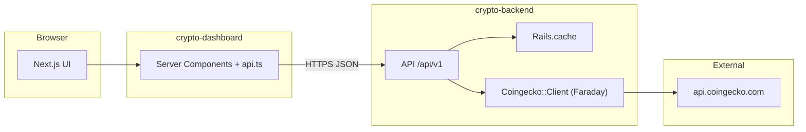

# Crypto Market Dashboard

A **full-stack** learning/product-style app: a **Next.js** dashboard in `crypto-dashboard` talks to a **Rails 8.1** JSON API in `crypto-backend`, which acts as a **backend-for-frontend (BFF)** in front of **CoinGecko’s** public (or Pro) HTTP API. The browser never calls CoinGecko directly; the Rails app centralizes access, **caches** responses, applies **CORS** and **rate limits**, and normalizes error handling.

---

## What you get in the UI

- **Home (`/`)** — Fetches a paginated “top markets” list (default 20). Each row shows name, symbol, **USD price**, and **24h % change** (color-coded), with links to a detail view.
- **Coin detail (`/coins/:id`)** — `:id` is a CoinGecko **coin id** (e.g. `bitcoin`, `ethereum`), not a numeric database id. The page loads coin metadata and a **Recharts** line chart of historical prices.
- **Chart range** — Query `?days=7`, `?days=30`, or `?days=365` to switch the market-chart window (clamped 1–365 on the server).

`app/loading.tsx` provides loading UI for route segments; list/detail pages are **Server Components** that call the API through `lib/api.ts` on the server.

---

## High-level architecture



- **Next.js** uses `axios` with a **single base URL** from `NEXT_PUBLIC_API_BASE_URL` (see `lib/apiClient.ts`). All fetches are relative to that origin.
- **Rails** is **API-only** (`config.api_only = true`): no default HTML pages for your domain logic; JSON in/out.
- **PostgreSQL** is required for Rails to boot and run tasks; **market data is not stored** in your DB in this project—the DB is for Rails infrastructure (e.g. Solid Queue/Cache/Cable as configured in the generated app).

---

## Repository layout

| Path | Role |
|------|------|
| `crypto-dashboard/` | Next.js 16 (App Router), React 19, TypeScript, Tailwind 4, axios, Recharts |
| `crypto-backend/` | Rails 8.1, Faraday, `rack-cors`, `rack-attack`, Solid Cache / Queue / Cable, PostgreSQL |

---

## Backend: behavior and design

### CoinGecko integration (`app/services/coingecko/client.rb`)

- Base URL: `https://api.coingecko.com/api/v3`
- A shared **Faraday** client uses `response: :raise_error` so HTTP failures become **`Faraday::*`** errors handled in `BaseController`.
- **Optional Pro key**: `COINGECKO_API_KEY` is sent on requests when set (Pro header/param patterns in the client).
- Methods map to: **markets list**, **single coin** (with `market_data` enabled, other sections trimmed to reduce payload), **market chart**, and **search**.

### HTTP caching (Rails)

Responses are wrapped in `Rails.cache.fetch` with key prefixes like `v1:coingecko:…` and JSON-serialized params. Approximate **TTLs**:

| Area | Cache TTL | Notes |
|------|------------|--------|
| `GET /api/v1/coins` (markets) | 60s | `vs_currency`, `per_page`, `page` in key; `per_page` clamped 1–250, `page` 1–100 |
| `GET /api/v1/coins/:id` | 30s | |
| `GET /api/v1/coins/:id/market_chart` | 2m | `vs_currency`, `days` (1–365) in key |
| `GET /api/v1/coins/search` | 30s | Query `q` must be at least **2** characters or `400` with `{ "error": "too short" }` |

Tuning: change `expires_in` in `CoinsController` and deploy; use Redis or memcached in production for shared cache if you run multiple Puma workers.

### Error handling (`app/controllers/api/v1/base_controller.rb`)

JSON errors are small and stable for the frontend to detect:

| Situation | HTTP | Body shape (typical) |
|----------|------|------------------------|
| Record not found | 404 | `{ "error": "not_found" }` |
| Upstream timeout / 5xx / connection failed | 502 | `{ "error": "upstream_unavailable" }` (logged server-side) |
| Faraday client error (4xx) | 429 or 502 | `{ "error": "upstream_error" }` (429 if CoinGecko returns 429) |
| Other `Faraday::Error` | 502 | `{ "error": "upstream_error" }` |
| Unhandled `StandardError` | 500 | `{ "error": "internal_error" }` — **treat as dev-friendly only**; narrow or remove `rescue_from StandardError` in production |

There is a comment in code to **avoid** rescuing all `StandardError` in production without careful logging/monitoring.

### CORS

`config/initializers/cors.rb` allows the origin from **`FRONTEND_URL`** (default `http://localhost:3000`) for the methods listed there. In production, set `FRONTEND_URL` to your real Next.js origin (scheme + host + port).

### Rate limiting (`Rack::Attack`, `config/initializers/rack_attack.rb`)

- **~100 requests/minute per IP** on all paths except `/up`.
- **~30 requests/minute per IP** for paths containing `coins/search`.
- `GET /up` is excluded from the general IP throttle (load balancers/health).

Responses use Rack::Attack’s default throttling response (typically **429**); tune limits for your API key tier and traffic.

---

## API reference (`/api/v1`)

| Method & path | Query / params | Response |
|---------------|----------------|----------|
| `GET /api/v1/coins` | `vs_currency` (default `usd`), `per_page` (default 20), `page` (default 1) | JSON array: CoinGecko “markets” objects (subset used in UI: `id`, `name`, `symbol`, `current_price`, `price_change_percentage_24h`, etc.) |
| `GET /api/v1/coins/:id` | — | JSON object: full coin payload from CoinGecko (name, symbol, `market_data`, …) |
| `GET /api/v1/coins/:id/market_chart` | `vs_currency` (default `usd`), `days` (default 7, clamped 1–365) | JSON: `{ "prices": [[ms, price], ...], "market_caps": [...], "total_volumes": [...] }` — chart uses `prices` |
| `GET /api/v1/coins/search` | `q` (min length 2) | `{ "coins": [ { id, name, symbol, market_cap_rank?, thumb? }, ... ] }` |

**Health check (Rails):** `GET /up` — use for process/load checks, not for CoinGecko status.

---

## Frontend: key files

| File | Role |
|------|------|
| `lib/apiClient.ts` | Axios instance, `baseURL` from `NEXT_PUBLIC_API_BASE_URL` |
| `lib/api.ts` | `fetchMarkets`, `fetchCoin`, `fetchMarketChart`, `searchCoins` |
| `types/coin.ts` | `CoinMarket`, `SearchCoin`, `MarketChartData` |
| `app/page.tsx` | Market list; error hint if API base URL or backend is down |
| `app/coins/[id]/page.tsx` | Coin title + `PriceChart`, day-range links |
| `components/PriceChart.tsx` | **Client component**; Recharts `LineChart` for `[timestamp, price]` pairs |
| `app/loading.tsx` | Global loading state for the App Router |

`searchCoins` is implemented for API parity; you can add a search box on the home page that calls it when you are ready for that UX.

### Chart sizing (Recharts)

`ResponsiveContainer` must measure a real-sized parent. If you see `width(-1) height(-1)` warnings, give the container an explicit **pixel height** (e.g. `height={320}`) or ensure the parent flex/grid has `min-w-0` and a defined height.

---

## Environment variables

### `crypto-dashboard`

Create `crypto-dashboard/.env.local`:

| Variable | Required | Example |
|----------|----------|---------|
| `NEXT_PUBLIC_API_BASE_URL` | **Yes** | `http://localhost:3001` (must match where Puma/Rails listens) |

Missing `NEXT_PUBLIC_API_BASE_URL` throws at import time in `getBase()`.

### `crypto-backend`

| Variable | Required | Notes |
|----------|----------|--------|
| `FRONTEND_URL` | No (default `http://localhost:3000`) | Allowed browser origin for CORS |
| `COINGECKO_API_KEY` | No | CoinGecko Pro; free tier can omit if your usage stays within their rules |
| `PORT` or `bin/rails s -p` | No | Default from Puma config is often 3000; use **3001** in docs so it doesn’t clash with Next (3000) |

---

## Local development

1. **Backend — database and server**

   ```bash
   cd crypto-backend
   bundle install
   bin/rails db:prepare
   bin/rails s -p 3001
   ```

2. **Frontend**

   ```bash
   cd crypto-dashboard
   npm install
   # .env.local: NEXT_PUBLIC_API_BASE_URL=http://localhost:3001
   npm run dev
   ```

3. Open **http://localhost:3000** — the API should be reachable at the URL in `NEXT_PUBLIC_API_BASE_URL`.

**Quick checks:** `curl -sI http://localhost:3001/up` should return `200`. A sample markets call: `curl -s "http://localhost:3001/api/v1/coins" | head -c 200`

---

## Scripts (dashboard)

- `npm run dev` — development server (Turbopack per Next 16)
- `npm run build` — production build
- `npm run start` — run production build
- `npm run lint` — ESLint (Next config)

---

## Heroku (backend)

The Git root is the monorepo parent, so there is **no `Gemfile` at the repository root** — Heroku’s detector reports *“No default language could be detected”* unless you point the build at `crypto-backend`. Use a **subdirectory buildpack** and set `PROJECT_PATH=crypto-backend`, then add `heroku/ruby`. Step-by-step commands, Postgres, and env vars are in **[crypto-backend/HEROKU.md](crypto-backend/HEROKU.md)**. A `Procfile` in `crypto-backend` defines the `web` and `release` processes.

---

## Production considerations (checklist)

- Set **`FRONTEND_URL`** to the deployed Next origin; lock down CORS to that host only.
- Use a **shared cache** (Redis) for `Rails.cache` if you scale Rails horizontally.
- **Rate limits** and CoinGecko **ToS/quotas** — monitor 429s; add retries or backoff on the client if needed.
- **Secrets**: `COINGECKO_API_KEY` via your host’s env or key vault, not committed.
- **Next.js**: set `NEXT_PUBLIC_API_BASE_URL` to your public API base URL.
- Tighten **`rescue_from StandardError`** for production and rely on proper logging/observability.

---

## License

Private project; adjust as needed.
